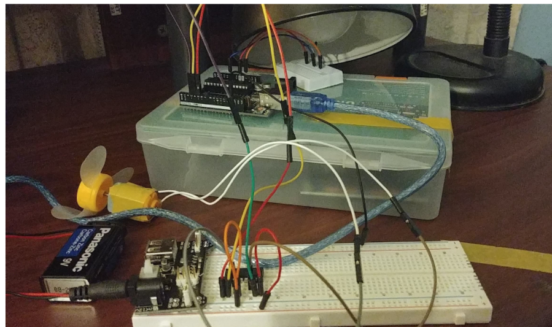

# dynamic-calibration-temp-sensor
> The program dynamically calibrates a thermistor that responds to the effects of a light source. The setpoint is set to 25 degrees. If the temperature of the thermistor (temperature sensor) exceeds the setpoint, the DC motor rotates. The rotating DC motor cools down the thermistor to drop the temperature reading to a threshold equal to or less than the setpoint. 

## Table of contents
* [General info](#general-info)
* [Technologies](#technologies)
* [Circuit Setup](#circuit-setup)
* [Status](#status)
* [Contact](#contact)

## General info
The purpose of this project is to explore the PID algorithm with the Atmega328 uController in addition to characterizing the response of the control system

## Technologies
* ArduinoIDE- version 1.8.13
* Arduino PID Library- version 1.2.0 - by [Brett Beauregard ](https://github.com/br3ttb/Arduino-PID-Library)

## Circuit Setup

> Mechanical & Electrical Set Up

## Status
Project is: _finished_

## Contact
Created by [@akansha-n888](https://www.linkedin.com/in/akansha-nagar/) - feel free to contact me!
